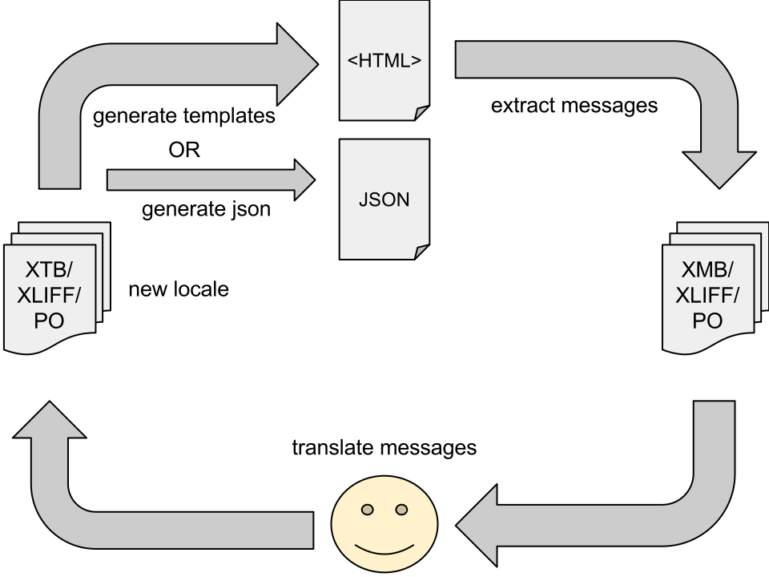

Internationalization, and Localization
======================================

- i18n is short for internationalization.  The 18 represents the number of 
characters in the word "internationalization" that are between the first "i",
and the last "n"

- i18n is the process of designing, and building applications that facilitate
localization (l10n)

- l10n is short for localization.  The ten represents the middle characters
between the "l", and the "n"

- l10n is the cultural, and linguistic adaptation of an i18n application to two
or more culturally distinct markets

## i18n Complexity 

Internationalization can affect entire applications, and all project members
need to be aware of it on some level, from designers to engineers, to QA.
The process includes all of the following:

- Languages
- Number formats, date formats, time formats, eg 1,000.00 vs 1.000,00
- Currency
- Text direction (left to right, right to left...)
- Symbols, graphics, and more

Complexity of the internationalization process can vary from relatively simple,
to quite complex.  One example of a relatively simple case would be two
languages with similar character sets, and the same text orientation.  An
example of a complex case would be several different languages with different
text orientations, and different character sets.

Unfortunately, even relatively simple internationalization can sometimes
dramatically change application text, and layout.  

Consider the following:

    
    Language | Message | Text Length | Expansion
    ---------|---------|-------------|----------
    English  | Set the power switch to 0. | 26 chars | -
    French   | Placez l'interrupteur de tension à 0. | 37 chars | 42% more characters
    Spanish  | Ponga el interruptor de alimentación de corriente en 0.| 55 chars | 112% more characters

## i18n in Angular (1.4+)

- Starts, and ends with HTML templates
- Can be done dynamically (no page reloads)
- Styles can be tested _while_ translators translate

Angular version 1.4x features a module called [Angular Translate][ngTranslate]
which adds a robust translation workflow to Angular. The Angular Translate
workflow looks like
  
  

[ngTranslate]:https://github.com/angular-translate/angular-translate "Angular Translate Module"

